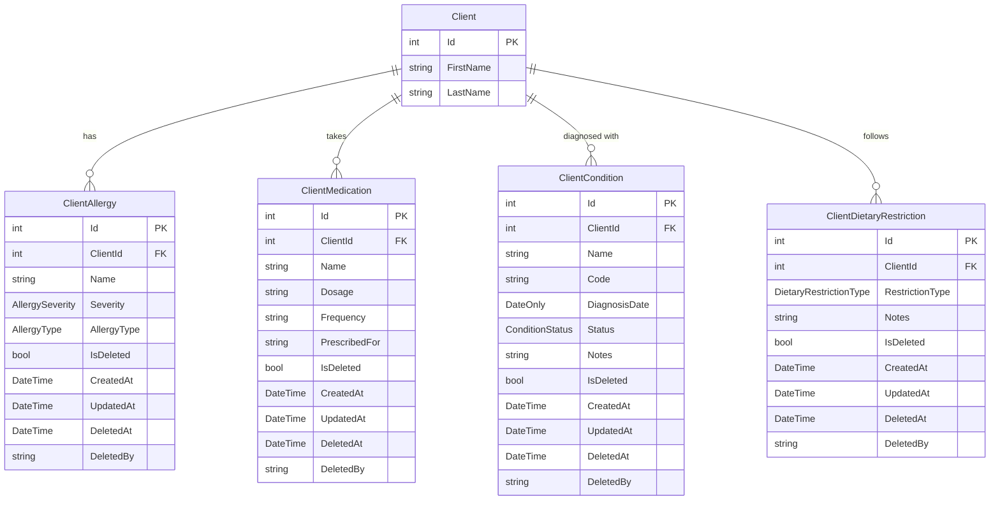

# Client Health Profile — Data Model

Structured health data attached to each client: allergies, medications, medical conditions, and dietary restrictions.

## Entity-Relationship Diagram

## Enums

### AllergySeverity

| Value | Description |
|-------|-------------|
| `Mild` | Minor reaction, no emergency treatment needed |
| `Moderate` | Noticeable reaction, may require treatment |
| `Severe` | Life-threatening, requires immediate intervention |

### AllergyType

| Value | Description |
|-------|-------------|
| `Food` | Food allergens (nuts, shellfish, etc.) |
| `Drug` | Medication allergies |
| `Environmental` | Pollen, dust, animal dander, etc. |
| `Other` | Catch-all for unclassified allergens |

### ConditionStatus

| Value | Description |
|-------|-------------|
| `Active` | Currently affecting the client |
| `Managed` | Under control with treatment |
| `Resolved` | No longer present |

### DietaryRestrictionType

| Value | Description |
|-------|-------------|
| `Vegetarian` | No meat |
| `Vegan` | No animal products |
| `GlutenFree` | No gluten-containing grains |
| `DairyFree` | No dairy products |
| `Kosher` | Follows kosher dietary laws |
| `Halal` | Follows halal dietary laws |
| `LowSodium` | Restricted sodium intake |
| `Ketogenic` | High-fat, low-carb diet |
| `NutFree` | No tree nuts or peanuts |
| `Other` | Custom restriction (see Notes) |

## Design Decisions

### Cascade Delete: Restrict

All four health profile tables use `OnDelete(DeleteBehavior.Restrict)` for the `ClientId` foreign key. This prevents accidental orphaning — a client cannot be hard-deleted while health records exist. Combined with soft-delete on both sides, this ensures referential integrity is always maintained.

### Soft-Delete Pattern

Each entity carries the standard soft-delete fields (`IsDeleted`, `DeletedAt`, `DeletedBy`) and a global query filter (`HasQueryFilter(x => !x.IsDeleted)`). Deleted records are excluded from queries by default but remain in the database for audit and compliance purposes.

### Indexes

Each table has an index on `ClientId` for efficient lookup of all health records belonging to a client.

### Enum Storage

All enum columns are stored as `string` (text) in PostgreSQL via `HasConversion<string>()`. This keeps the database human-readable and avoids integer-mapping drift when enum values are added or reordered.

### String Lengths

| Column | Max Length | Rationale |
|--------|-----------|-----------|
| `Name` | 100 | Allergy/medication/condition names |
| `Dosage` | 100 | e.g. "500mg", "10mL" |
| `Frequency` | 100 | e.g. "Twice daily", "As needed" |
| `PrescribedFor` | 200 | Reason for prescription |
| `Code` | 20 | ICD-10 or similar codes |
| `Notes` | text | Free-form, unbounded |
