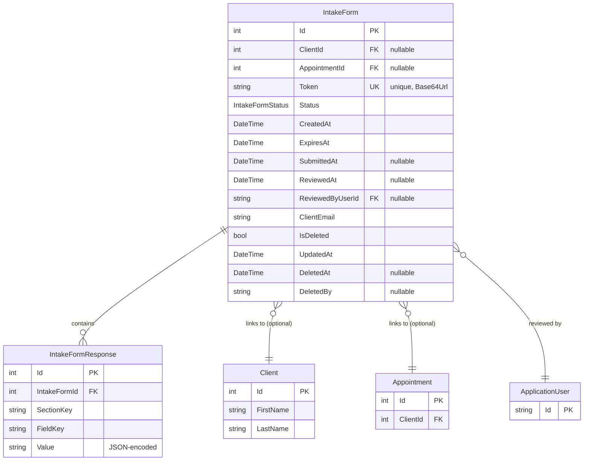

# Pre-Appointment Digital Intake Form — Design

Structured intake form workflow for collecting client health, lifestyle, and dietary information before appointments. Practitioners create shareable links; clients submit via web form; practitioners review and map to client profiles.

## Entity-Relationship Diagram



## Data Model

### IntakeForm Entity

| Field | Type | Constraints | Description |
|-------|------|-------------|-------------|
| Id | int | PK | Primary key |
| ClientId | int? | FK to Client | Null if form precedes client creation |
| AppointmentId | int? | FK to Appointment | Null if form created independently |
| Token | string | Unique, 43 chars | URL-safe base64 token — 32 bytes from `RandomNumberGenerator` encoded via base64url |
| Status | enum | Required | Pending \| Submitted \| Reviewed \| Expired |
| CreatedAt | DateTime | Required | Timestamp of form creation |
| ExpiresAt | DateTime | Required | Default: 7 days from `CreatedAt`, configurable via `IntakeFormOptions.ExpiryDays` |
| SubmittedAt | DateTime? | Nullable | Recorded when status changes to Submitted |
| ReviewedAt | DateTime? | Nullable | Recorded when status changes to Reviewed |
| ReviewedByUserId | string? | FK to ApplicationUser | Practitioner who reviewed the submission |
| ClientEmail | string | Required | Email address the form link was sent to — immutable after creation |
| IsDeleted | bool | Required, default false | Soft-delete flag |
| UpdatedAt | DateTime | Required | Updated on every change |
| DeletedAt | DateTime? | Nullable | Set when soft-deleted |
| DeletedBy | string? | Nullable | User ID of who soft-deleted the record |

### IntakeFormResponse Entity

| Field | Type | Constraints | Description |
|-------|------|-------------|-------------|
| Id | int | PK | Primary key |
| IntakeFormId | int | FK to IntakeForm | Links to parent intake form |
| SectionKey | string | Required, max 50 | e.g. `personal_info`, `medical_history`, `dietary_habits`, `goals`, `consent` |
| FieldKey | string | Required, max 50 | e.g. `first_name`, `allergies`, `weight_kg` |
| Value | string | Required | JSON-encoded value — strings, numbers, booleans, arrays stored as JSON |

### Status Enum

| Value | Meaning |
|-------|---------|
| `Pending` | Form link created, not yet submitted |
| `Submitted` | Client submitted the form |
| `Reviewed` | Practitioner reviewed and processed (client created or updated) |
| `Expired` | Form link expired; resubmission denied |

## Section Keys and Field Keys

Sections and fields are defined as constants in code, not in the database. This design maintains flexibility for future localization without schema migration.

### personal_info

Required section collecting basic client demographics.

| FieldKey | Type | Validation | Notes |
|----------|------|-----------|-------|
| first_name | string | Required, max 100 | Client first name |
| last_name | string | Required, max 100 | Client last name |
| email | string | Required, email format | Contact email |
| phone | string | Optional, max 20 | Phone number with country code |
| date_of_birth | string | Required, ISO date (YYYY-MM-DD) | For age calculation and chronology |
| sex | string | Optional, enum: M / F / Other / Prefer not to say | Biological sex |
| height_cm | number | Optional, range 100–300 | Height in centimeters (future BMI calc) |
| weight_kg | number | Optional, range 20–250 | Weight in kilograms (future BMI calc) |
| emergency_contact_name | string | Optional, max 100 | Emergency contact person |
| emergency_contact_phone | string | Optional, max 20 | Emergency contact phone |

### medical_history

Medical and allergy information.

| FieldKey | Type | Validation | Notes |
|----------|------|-----------|-------|
| conditions | string | Optional, JSON array of strings | e.g. `["Diabetes Type 2", "Hypertension"]` — mapped to ClientCondition |
| medications | string | Optional, JSON array of objects | e.g. `[{"name": "Metformin", "dosage": "500mg", "frequency": "Twice daily"}]` — mapped to ClientMedication |
| allergies | string | Optional, JSON array of objects | e.g. `[{"name": "Peanut", "severity": "Severe"}]` — mapped to ClientAllergy |
| surgeries | string | Optional, text | Free-form description of past surgeries |
| family_history | string | Optional, text | Family health history and hereditary conditions |
| additional_notes | string | Optional, text | Practitioner-visible clinical notes |

### dietary_habits

Lifestyle and dietary patterns.

| FieldKey | Type | Validation | Notes |
|----------|------|-----------|-------|
| dietary_restrictions | string | Optional, JSON array of strings | e.g. `["Vegetarian", "Gluten-Free"]` — mapped to ClientDietaryRestriction |
| typical_breakfast | string | Optional, text | Description of typical breakfast |
| typical_lunch | string | Optional, text | Description of typical lunch |
| typical_dinner | string | Optional, text | Description of typical dinner |
| snacking_habits | string | Optional, text | Snacking patterns and preferences |
| water_intake | string | Optional, text | e.g. "8 glasses daily", "sporadic" |
| alcohol_frequency | string | Optional, enum: Never / Rarely / Occasionally / Regularly / Daily | Alcohol consumption frequency |
| caffeine_intake | string | Optional, text | e.g. "2 cups coffee daily" |
| supplements | string | Optional, JSON array of objects | e.g. `[{"name": "Vitamin D", "dosage": "2000 IU daily"}]` |

### goals

Client goals and expectations.

| FieldKey | Type | Validation | Notes |
|----------|------|-----------|-------|
| primary_goals | string | Optional, JSON array of strings | e.g. `["Weight loss", "Energy boost"]` |
| specific_concerns | string | Optional, text | Specific health or dietary concerns |
| timeline_expectations | string | Optional, text | e.g. "3 months", "6 months" |
| previous_nutrition_counseling | string | Optional, bool-like | "Yes" / "No" or "true" / "false" |
| what_worked_before | string | Optional, text | Previous successful interventions |
| what_didnt_work | string | Optional, text | Previous unsuccessful attempts |

### consent

Legal and data-sharing agreements.

| FieldKey | Type | Validation | Notes |
|----------|------|-----------|-------|
| consent_given | string | Required, bool-like | "true" / "false" or "yes" / "no" — must be true to create client |
| consent_policy_version | string | Required, max 20 | e.g. "1.0", "1.1" — matches `ConsentPolicyVersion` in code |
| consent_timestamp | string | Required, ISO datetime | Client's consent timestamp (can be captured server-side during submission) |
| data_sharing_acknowledged | string | Optional, bool-like | "true" / "false" — whether client acknowledges data sharing with practitioners |

## Workflow

```
1. Practitioner Dashboard
   └─ Create Intake Form
      ├─ Select Client (optional) → ClientId set if reusing for existing client
      ├─ Select Appointment (optional) → AppointmentId set if linked to appointment
      ├─ Enter Client Email
      ├─ (optional) Configure ExpiresAt (defaults to +7 days)
      └─ Generate Token → Create IntakeForm record with Status=Pending
         └─ Email sent to ClientEmail with link: /intake/{token}

2. Client Portal
   └─ Click link → /intake/{token}
      ├─ Verify token exists and Status=Pending and not expired
      ├─ Display multi-step form (personal_info → medical_history → dietary_habits → goals → consent)
      ├─ Client fills form
      └─ Client submits
         └─ Validate consent_given=true
         └─ Create IntakeFormResponse records for each section/field
         └─ Update IntakeForm: Status=Submitted, SubmittedAt=now()
         └─ Send notification to practitioner

3. Practitioner Review Dashboard
   └─ Navigate to /clients/intake/{formId}/review
      ├─ Display all IntakeFormResponse values
      ├─ Show mapping preview (how fields will be assigned to Client entity)
      └─ Click "Create Client" / "Update Client"
         └─ If ClientId is null: create new Client entity from responses
         └─ If ClientId is set: update existing Client entity
         └─ Create ClientCondition, ClientMedication, ClientAllergy, ClientDietaryRestriction records
         └─ Update IntakeForm: Status=Reviewed, ReviewedAt=now(), ReviewedByUserId=current user
         └─ Soft-delete IntakeForm (or mark as archived to preserve audit trail)
```

## Edge Cases

### Expired Token
If a client navigates to an expired intake form link:
- Check `ExpiresAt < DateTime.UtcNow`
- Update `Status` to `Expired`
- Display: *"This intake form link has expired. Please contact your nutritionist for a new link."*
- Do not allow form submission

### Already Submitted
If a client attempts to resubmit an already-submitted form:
- Check `Status == Submitted` or `Status == Reviewed`
- Display: *"This form has already been submitted. Thank you!"*
- Do not allow resubmission
- Redirect to confirmation page or back to home

### Invalid/Unknown Token
If token is not found in database:
- Display generic 404 page (do not leak that intake forms exist)
- Log the access attempt for security monitoring

### Token Reuse Prevention
Tokens are single-use by design:
- Once `Status` changes from `Pending` to `Submitted`, the form cannot be resubmitted
- If client needs to revise, practitioner creates a new intake form with a new token
- Archive old token and form record (soft-delete)

### Client Already Exists
If `ClientId` is set at form creation:
- Review step updates existing Client entity instead of creating a new one
- Existing ClientCondition/ClientMedication/ClientAllergy/ClientDietaryRestriction records are soft-deleted and replaced with new ones from the form
- Audit logging captures the update (reviewer ID, timestamp, old vs. new values)

## Token Generation Strategy

```csharp
// 32 bytes of cryptographic randomness
using (var rng = new System.Security.Cryptography.RNGCryptoServiceProvider())
{
    byte[] tokenBytes = new byte[32];
    rng.GetBytes(tokenBytes);
    string token = Convert.ToBase64String(tokenBytes)
        .TrimEnd('=')
        .Replace('+', '-')
        .Replace('/', '_');
    // token is now a 43-character URL-safe string
}
```

### Properties

- **Uniqueness:** Indexed uniquely in the database for fast lookups and collision prevention
- **Non-sequential:** Cryptographically random, not guessable or enumerable
- **URL-safe:** Base64Url encoding allows direct use in URLs without encoding
- **Stateless lookup:** No parsing or decoding needed; direct database lookup by token value

## Configuration

Create `IntakeFormOptions` in `appsettings.json`:

```json
{
  "IntakeForm": {
    "ExpiryDays": 7,
    "ConsentPolicyVersion": "1.0"
  }
}
```

| Key | Type | Default | Description |
|-----|------|---------|-------------|
| `ExpiryDays` | int | 7 | Number of days before intake form link expires |
| `ConsentPolicyVersion` | string | "1.0" | Current version of the consent policy — stored in responses for audit |

## Client Field Mapping (Review Step)

When a practitioner clicks "Create Client" or "Update Client" on the review page, IntakeFormResponse values are mapped to Client entity fields and related tables.

### Direct Client Fields

| IntakeFormResponse Key | Client Field | Notes |
|------------------------|--------------|-------|
| personal_info.first_name | FirstName | Max 100 chars |
| personal_info.last_name | LastName | Max 100 chars |
| personal_info.email | Email | Unique, indexed |
| personal_info.phone | Phone | Optional |
| personal_info.date_of_birth | DateOfBirth | DateTime, parsed from ISO date string |

### Related Entity Mapping

| IntakeFormResponse Key | Related Entity | Mapping Logic |
|------------------------|---|----------|
| medical_history.conditions | ClientCondition | Create one record per array element; populate Name field; Status defaults to Active |
| medical_history.medications | ClientMedication | Create one record per array element; parse Name, Dosage, Frequency from object |
| medical_history.allergies | ClientAllergy | Create one record per array element; parse Name, Severity from object; AllergyType defaults to Food |
| dietary_habits.dietary_restrictions | ClientDietaryRestriction | Create one record per array element; parse RestrictionType from string |
| consent.consent_given | Client.ConsentGiven | Boolean, must be true |
| consent.consent_timestamp | Client.ConsentTimestamp | DateTime, parsed from ISO datetime string |
| consent.consent_policy_version | Client.ConsentPolicyVersion | String, e.g. "1.0" |

### Fields Without Direct Mapping

These fields are captured in IntakeFormResponse but do not map to the Client entity in v1. They are preserved for future expansion:

- personal_info.sex
- personal_info.height_cm
- personal_info.weight_kg
- personal_info.emergency_contact_name
- personal_info.emergency_contact_phone
- medical_history.surgeries
- medical_history.family_history
- medical_history.additional_notes
- dietary_habits.typical_breakfast
- dietary_habits.typical_lunch
- dietary_habits.typical_dinner
- dietary_habits.snacking_habits
- dietary_habits.water_intake
- dietary_habits.alcohol_frequency
- dietary_habits.caffeine_intake
- dietary_habits.supplements
- goals.*

## Database Schema Conventions

### Soft-Delete Pattern

Both `IntakeForm` and `IntakeFormResponse` entities use the standard soft-delete pattern:
- `HasQueryFilter(e => !e.IsDeleted)` in `AppDbContext`
- Query results exclude deleted forms by default
- Deleted records remain in the database for audit and compliance

### Indexes

- `IntakeForm.Token` — unique index for fast token lookups
- `IntakeForm.ClientId` — index for retrieving forms for a given client
- `IntakeForm.AppointmentId` — index for retrieving forms linked to an appointment
- `IntakeFormResponse.IntakeFormId` — index for retrieving all responses for a form
- `IntakeFormResponse (IntakeFormId, SectionKey, FieldKey)` — composite index for efficient response retrieval

### Enum Storage

- `IntakeForm.Status` stored as `string` in PostgreSQL via `HasConversion<string>()`
- Allows direct SQL querying by status name without integer mapping

### String Lengths

| Column | Max Length | Rationale |
|--------|-----------|-----------|
| `Token` | 43 | Fixed size, base64url encoded 32 bytes |
| `ClientEmail` | 255 | Standard email length |
| `SectionKey` | 50 | e.g. "personal_info", "medical_history" |
| `FieldKey` | 50 | e.g. "first_name", "allergies" |
| `Value` | text | Unbounded; JSON arrays and objects may be large |

## Audit and Compliance

- Every IntakeForm creation is logged via `IAuditLogService.LogAsync()` with action "IntakeFormCreated"
- Every submission is logged with action "IntakeFormSubmitted"
- Every review/client creation is logged with action "IntakeFormReviewed"
- All IntakeFormResponse values are immutable after submission
- Soft-deleted forms and responses are retained for compliance (PIPEDA data retention requirements)
- Token is not logged in full in audit records; first 8 and last 4 chars are logged for obfuscation

## Real-Time Notifications

When a client submits an intake form:
- `INotificationDispatcher.DispatchAsync()` sends a notification to all connected practitioners
- Practitioners see a banner on their dashboard: *"New intake form submission from [ClientEmail]"*
- Link provided to jump directly to the review page

When a practitioner reviews and creates a client:
- Practitioners in the same context are notified of the new client creation (if configured)
