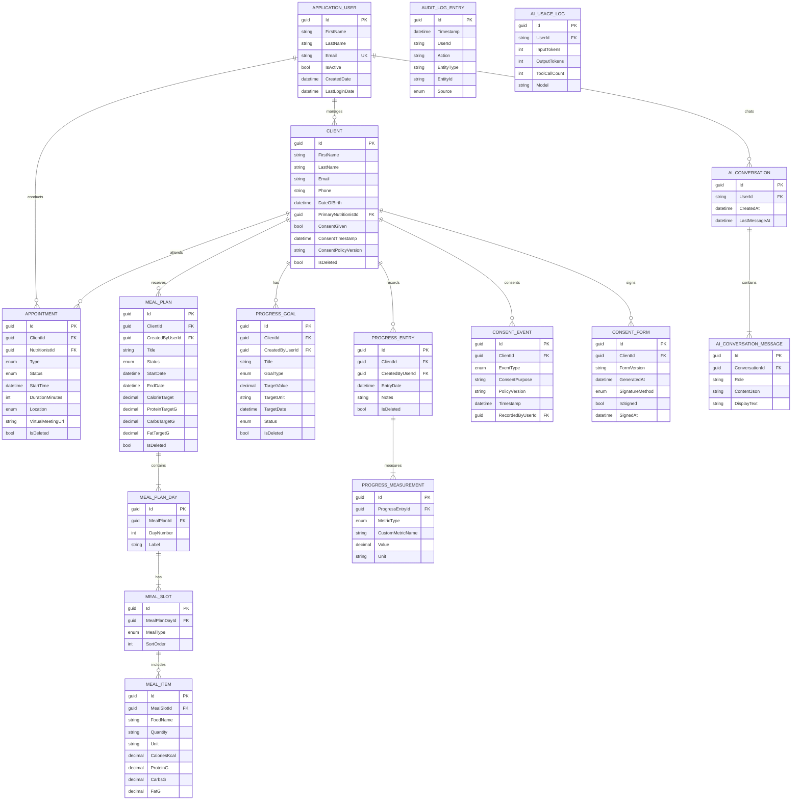

# Architecture Diagrams

Visual diagrams for the Nutrir application architecture. Rendered using [Mermaid](https://mermaid.js.org/).

## Table of Contents

- [System Context (C4 Level 1)](#system-context)
- [Container Diagram (C4 Level 2)](#container-diagram)
- [Domain Model (ER Diagram)](#domain-model)
- [Middleware Pipeline](#middleware-pipeline)
- [AI Assistant Request Flow](#ai-assistant-request-flow)
- [Project Dependency Graph](#project-dependency-graph)

---

## System Context

High-level view of Nutrir and its external dependencies.

---

## Container Diagram

Internal containers and services within the Nutrir platform.

---

## Domain Model

Entity relationships across all four v1 domains plus auth, compliance, and AI.

---

## Middleware Pipeline

Request processing order through the ASP.NET Core middleware stack.

---

## AI Assistant Request Flow

Sequence of events when a user interacts with the AI assistant panel.

---

## Project Dependency Graph

How the four .NET projects reference each other.

