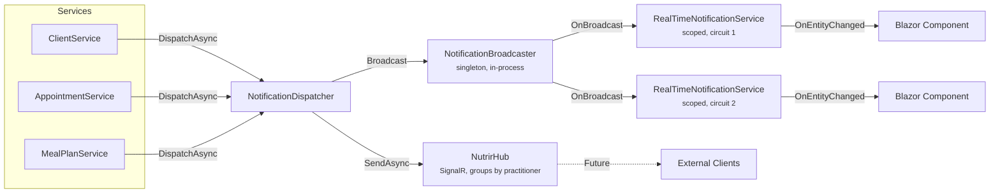

# Real-Time Notifications

Live entity-change notifications across all active Blazor circuits, enabling pages to refresh automatically when data changes elsewhere in the application.

## Architecture



### Key Files

| File | Scope | Purpose |
|------|-------|---------|
| `src/Nutrir.Core/DTOs/EntityChangeNotification.cs` | — | Notification payload record |
| `src/Nutrir.Core/Interfaces/INotificationDispatcher.cs` | — | Dispatch interface used by services |
| `src/Nutrir.Web/Hubs/NotificationDispatcher.cs` | Singleton | Bridges services to both broadcast channels |
| `src/Nutrir.Web/Services/NotificationBroadcaster.cs` | Singleton | In-memory event bus for Blazor circuits |
| `src/Nutrir.Web/Services/RealTimeNotificationService.cs` | Scoped | Per-circuit bridge; components subscribe to `OnEntityChanged` |
| `src/Nutrir.Web/Hubs/NutrirHub.cs` | Hub | SignalR hub, groups by `practitioner-{userId}` |

## Notification Payload

```csharp
public record EntityChangeNotification(
    string EntityType,            // "Client", "Appointment", "MealPlan"
    int EntityId,                 // ID of the changed entity
    EntityChangeType ChangeType,  // Created, Updated, Deleted
    string PractitionerUserId,    // User who made the change
    DateTime Timestamp);          // UTC
```

`EntityChangeType` is an enum with values: `Created`, `Updated`, `Deleted`.

**No PHI in the payload.** The notification is a signal only — receiving components fetch fresh data from the database after being notified. This keeps the broadcast channel compliance-safe.

## Dispatch Points

All dispatching services use a private `TryDispatchAsync` helper that wraps the dispatch in a try-catch, preventing notification failures from blocking business logic.

| Service | Method | Entity Type | Change Type |
|---------|--------|-------------|-------------|
| ClientService | `CreateAsync` | Client | Created |
| ClientService | `UpdateAsync` | Client | Updated |
| ClientService | `SoftDeleteAsync` | Client | Deleted |
| AppointmentService | `CreateAsync` | Appointment | Created |
| AppointmentService | `UpdateAsync` | Appointment | Updated |
| AppointmentService | `UpdateStatusAsync` | Appointment | Updated |
| AppointmentService | `SoftDeleteAsync` | Appointment | Deleted |
| MealPlanService | `CreateAsync` | MealPlan | Created |
| MealPlanService | `UpdateMetadataAsync` | MealPlan | Updated |
| MealPlanService | `SaveContentAsync` | MealPlan | Updated |
| MealPlanService | `UpdateStatusAsync` | MealPlan | Updated |
| MealPlanService | `DuplicateAsync` | MealPlan | Created |
| MealPlanService | `SoftDeleteAsync` | MealPlan | Deleted |

**Not dispatching:** `ProgressService` and `ConsentFormService` do not dispatch notifications (known gap).

## Consumer Pages

| Page | Listens For | Debounce | Behavior |
|------|------------|----------|----------|
| ClientList | Client | 1500ms | Reloads full client list |
| ClientDetail | Client (matching ID), MealPlan, Appointment | None | Reloads all client data + related entities |
| AppointmentList | Appointment | 1500ms | Reloads full appointment list |
| AppointmentDetail | Appointment (matching ID) | None | Reloads single appointment |
| MealPlanList | MealPlan | 1500ms | Reloads full meal plan list |
| MealPlanDetail | MealPlan (matching ID) | None | Reloads single meal plan |

All consumer pages display an "Updated in real time" banner when refreshed by a notification.

## Component Integration Pattern

```csharp
@inject RealTimeNotificationService NotificationService
@implements IAsyncDisposable

@code {
    private System.Threading.Timer? _notificationDebounceTimer;

    protected override async Task OnInitializedAsync()
    {
        // Subscribe to broadcast events
        NotificationService.OnEntityChanged += OnEntityChanged;
        await NotificationService.StartAsync();

        await LoadDataAsync();
    }

    private void OnEntityChanged(EntityChangeNotification notification)
    {
        if (notification.EntityType != "MyEntity")
            return;

        // Option A: Immediate reload (detail pages)
        _ = InvokeAsync(async () =>
        {
            await LoadDataAsync();
            StateHasChanged();
        });

        // Option B: Debounced reload (list pages)
        _notificationDebounceTimer?.Dispose();
        _notificationDebounceTimer = new System.Threading.Timer(async _ =>
        {
            await InvokeAsync(async () =>
            {
                await LoadDataAsync();
                StateHasChanged();
            });
        }, null, 1500, Timeout.Infinite);
    }

    public ValueTask DisposeAsync()
    {
        NotificationService.OnEntityChanged -= OnEntityChanged;
        _notificationDebounceTimer?.Dispose();
        return ValueTask.CompletedTask;
    }
}
```

## Design Decisions

- **In-process bus over SignalR self-connection**: The original architecture had the app connecting to its own SignalR hub, which broke in Docker due to port mismatch. The `NotificationBroadcaster` singleton replaces this with a simple in-memory event.
- **SignalR hub retained**: `NutrirHub` still broadcasts to SignalR groups for future external clients (mobile apps, etc.).
- **Notifications are signals only**: No PHI in the payload. Components fetch fresh data after receiving a notification, keeping the broadcast channel compliance-safe.
- **List pages debounce (1500ms)**: Prevents rapid re-renders when multiple entities change in quick succession (e.g., bulk operations).
- **Detail pages refresh immediately**: Single-entity pages filter by ID and reload instantly for responsiveness.
- **Meal plan notifications are plan-level only**: Changes to days, slots, and items dispatch a notification for the parent `MealPlan`, not individual child entities.

## Known Gaps

- **ProgressService and ConsentFormService** do not dispatch notifications — pages showing progress or consent data won't auto-refresh.
- **No `ClientId` on payload**: `ClientDetail` refreshes on *any* MealPlan or Appointment change from the same practitioner, not just those for the current client.
- **No concurrent edit detection**: If two browser tabs edit the same entity, last writer wins with no warning.
- **No notification ordering guarantees**: Notifications may arrive out of order under high concurrency.
